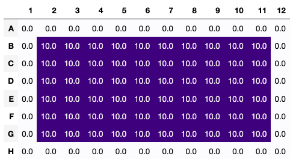

# PyPlate

[](https://pypi.org/project/pyplate-hte)
[](https://pyplate-hte.readthedocs.io/en/latest/?badge=latest)
[](https://pypi.org/project/pyplate-hte)

An open-source Python-based ontology and tool for designing, implementing, and reproducing high-throughput experiments (HTE).

### Introduction

PyPlate provides tools for the design and implementation of high-throughput chemistry and biology experiments (e.g., reaction screening, cell assays, chromatography screening).  It allows the user to define a space of experimental parameters to be explored, select points in that space for experimentation, and design liquid/solid handling steps to implement those experiments in 96 well plates.

### Installation

PyPlate requires Python 3.10 or later.

`pip install pyplate-hte`

To view plate visualizations, you will need an interactive Python shell like Jupyter.

**Note:** A similarly named package `pyplate` also exists on PyPi.  Be sure to install `pyplate-hte` and **not** `pyplate`.

## Quick Start

Here is a simple example that illustrates some of the core features of `PyPlate`:

```python

from pyplate import Substance, Container, Plate, Recipe

triethylamine = Substance.liquid(name="triethylamine", mol_weight=101.19, density=0.726)
water = Substance.liquid(name="water", mol_weight=18.015, density=1.0)

triethylamine_50mM = Container.create_solution(solute=triethylamine, solvent=water, concentration='50 mM',
                                               total_quantity='10 mL')

plate = Plate(name='plate', max_volume_per_well='50 uL')

recipe = Recipe().uses(triethylamine_50mM, plate)
recipe.transfer(source=triethylamine_50mM, destination=plate[2:7, 2:11], quantity='10 uL')
results = recipe.bake()
triethylamine_50mM = results[triethylamine_50mM.name]
plate = results[plate.name]

recipe.visualize(what=plate, mode='final', unit='uL', timeframe=0)

```



## Documentation

Online documentation is available at [ReadTheDocs](https://pyplate-hte.readthedocs.io/en/latest/).  To build the documentation locally, please follow these steps:

``make -C docs html``

The resulting HTML files will be in `docs/build/html`.

In order to build the documentation successfully, you must install the packages listed in docs/requirements.txt.  You can do this by running:

``pip install -r docs/requirements.txt``

## License

Licensed under the [Apache License, Version 2.0](https://www.apache.org/licenses/LICENSE-2.0) (the "License").

## Contributors

**PyPlate** was designed and written by James Marvin, Eugene Kwan, Corin Wagen, Aryamaan Dhomne, and Pravin Mahendran.

## Getting Help

Please open a GitHub issue!  We respond regularly.  Please also feel free to contribute!
