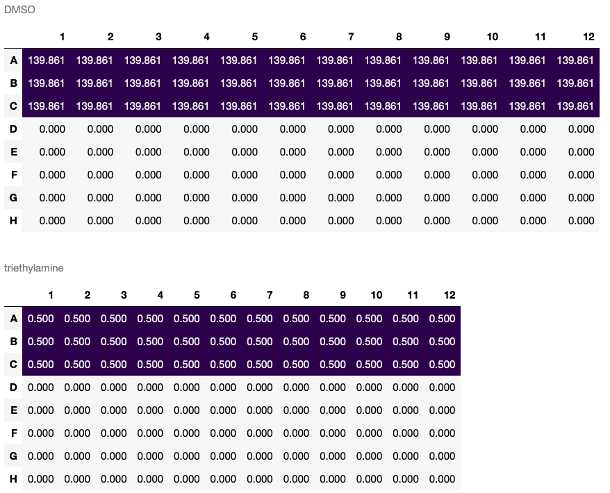

# PyPlate

An open-source Python tool for high-throughput chemistry.

### Introduction

PyPlate provides tools for the design and implementation of high-throughput chemistry experiments (in particular, reaction screening).  It allows the user to define a space of experimental parameters to be explored, select points in that space for experimentation, and design liquid/solid handling steps to implement those experiments in 96 well plates.

### Installation

PyPlate requires Python 3.10 or later.

`pip install pyplate-hte`

To view plate visualizations, you will need an interactive Python shell like Jupyter.

### Philosophy

All experiments are divided into a *design* phase and an *implementation* phase.

**Design Phase**: TBD

**Implementation Phase**: PyPlate mimics the physical process of dispensing solids or liquids into plates.  `Substance`s are placed into `Container`s and dispensed into `Plate`s.  The instructions for creating a set of plates are grouped into `Recipe` objects.

- add something about how to check that the implementation and design are consistent
- All objects in PyPlate are considered immutable.

## Quick Start

```python

from pyplate import Substance, Container, Plate, Recipe

triethylamine = Substance.liquid(name="triethylamine", mol_weight=101.19, density=0.726)
DMSO = Substance.liquid(name="DMSO", mol_weight=78.13, density=1.1004)

triethylamine_50mM = Container.create_solution(solute=triethylamine, solvent=DMSO, concentration='50 mM', total_quantity='10 mL')
plate = Plate(name='plate', max_volume_per_well='50 uL')

recipe = Recipe().uses(triethylamine_50mM, plate)
recipe.transfer(source=triethylamine_50mM, destination=plate[2:7, 2:11], quantity='10 uL')
triethylamine_50mM, plate = recipe.bake()

recipe.steps[-1].visualize(what='destination', mode='final', unit='uL')[0]

```

## User Guide

### Substances

A `Substance` is a solid, liquid, or enzyme:

```python
# solid
sodium_chloride = Substance.solid(name="Sodium Chloride", mol_weight=58.44)

# liquid
water = Substance.liquid(name="Water", mol_weight=18.01528, density=1.0)

# enzyme
enzyme_X = Substance.enzyme(name="Enzyme X")
```

Enzymes are like solids, but are specified in *units of activity* instead of moles.  The default density for substances is 1.0.

### Containers

A `Container` holds defined amounts of a set of `Substance`s and has a maximum volume.

Placing 10 g of NaCl in a 1 L container:

```python
sodium_chloride_stock = Container(name = "sodium_chloride_stock",
                                  max_volume = "1 L",
                                  initial_contents =
                                      [(sodium_chloride, "10 g")])
```

Making 10 mL of a 0.01 M stock solution of NaCl in water:

```python
sodium_chloride_10mM = Container.create_solution(
                           solute = sodium_chloride,
                           solvent = water,
                           concentration = "0.01 M",
                           total_quantity = "10 mL")
```

Diluting the above solute to 0.005 M:

```python
sodium_chloride_10mM, sodium_chloride_5mM = Container.create_solution_from(source=sodium_chloride_10mM, solute=sodium_chloride, concentration="5 mM", solvent=water, quantity="10 mL")
```

### Manipulating Containers

`Container`s can be diluted to a desired concentration or filled to a desired volume.

```python
salt_water = salt_water.dilute(solute=sodium_chloride_10mM, concentration='5 mM', solvent=water)
salt_water = salt_water.fill_to(solvent=water, quantity='50 mL')
```

### Creating a Plate

`Plate`s are rectangular arrays of `Container`s.

To create a generic 96 well plate:

`plate = Plate(name="test plate", max_volume_per_well="50 uL")`

Custom plates can be created with different numbers of rows and columns as well as different labels:

`plate = Plate(name="custom plate", max_volume_per_well="50 uL", rows=16, columns=24)`
`plate = Plate(name="custom plate", max_volume_per_well="50 uL", rows=['i', 'ii', 'iii'], columns=['a', 'b', c'])`

### Locations on a Plate and slices

PyPlate follows the `pandas` convention of having both integer- and label-based indices for referencing wells in `Plate`s.  When row or column specifiers are provided as integers, they are assumed to be integer indices (1, 2, 3, ...).  When specifiers are provided as strings, they are assumed to be label indices ("A", "B", "C", ...).

By default, rows in plates are given alphabetical labels "A", "B", "C", ... and columns in plates are given numerical labels 1, 2, 3.  However, rows and columns are always given integer indices 1, 2, 3, ....  For example, "B:3" and (2,3) both refer to well B3.

Here are some ways to refer to a specific well:

- **String Method**: "A:1"
- **Tuple Method**: ('A', 1)

You can refer to multiple wells as a list:

`plate[[('A', 1), ('B', 2), ('C', 3), 'D:4']]`


Slicing syntax is supported:


- In addition, you can provide python slices of wells with 1-based indexes:
  - `plate[:3], plate[:, :3], plate['C':], plate[1, '3':]`

### Recipes

A `Recipe` is a set of instructions for transforming one set of containers into another.

```python
plate = Plate(name='plate', max_volume_per_well='50 uL')
recipe = Recipe()
```

`Container`s and `Plate`s must be declared in the `Recipe` before use:

```python
recipe.uses(plate)
```

It can be convenient to create solutions and declare them for use in the same step:

```python
triethylamine_50mM = recipe.create_solution(solute=triethylamine, solvent=DMSO, concentration='0.05 M', total_quantity='10.0 mL')
```

(Note that solutions made in this way are not actually created until `recipe.bake()` is called.)  Performing transfer steps:

```python
recipe.transfer(source=triethylamine_50mM, destination=plate[:3], quantity='10 uL')
```

When `recipe.bake()` is called, the resulting `Container` and `Plate` objects are returned (leaving the input objects, if any, unchanged) in order of declaration or creation:

```
plate, triethylamine_50mM = recipe.bake()
```


Each operation called on a recipe is stored as a step. You can retrieve the steps for a recipe using `recipe.steps`.
Each step has instructions as to what happened during the step (`step.instruction`) as well as visualizations.


### Visualizations

Each step in a recipe that involves a plate will yield visualizations. We can visualize information about the source or
destination plate (as applicable) or both. Visualization can be determined for two different modes, either the 'final' state of the plate or a 'delta' of what changed during the step. Finally, the unit in which data is returned must be provided.

```
...
last_step = recipe.steps[-1]
for df in last_step.visualize(what='destination', mode='delta', unit='umol'):
    display.display_html(df)
```


### Units

The basic units of pyplate are moles, grams, liters, and activity units. ('mol', 'g', 'L', 'U')

Any time units are required, metric prefixes may be specified. ('mg', 'umol', 'dL', ...)

All quantities are specified as strings with a value and a unit. ('1 mmol', '10 g', '10 uL' ...)

### Building documentation

Documentation can be built by executing `make docs`. The resulting documentation will be in the `docs` folder.

### Running tests

Tests can be run by executing `pytest`.
## License

Licensed under the Apache License, Version 2.0 (the "License")
You may obtain a copy of the License at https://www.apache.org/licenses/LICENSE-2.0