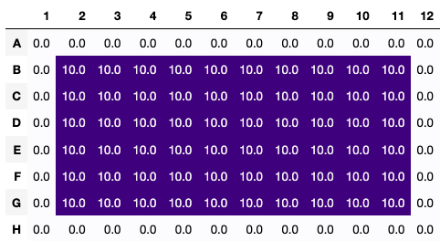

.. _introduction:

Introduction
============

``PyPlate`` defines a set of Python-based semantics for designing and
implementing high-throughput experiments (HTE).  ``PyPlate``
aspires to define a clear, useful, and reproducible ontology for HTE.

Features
""""""""

- stoichiometry calculations
- enumeration of solid/liquid handling steps
- visualization of HTE plates
- support for small and large molecules
- "compile-time" checks to ensure that proposed experiments are physically reasonable
- enumeration of full factorial designs or other design spaces

Core Classes
""""""""""""

``PyPlate`` defines all experiment designs with three key nouns:

- ``Factor``: A variable that is under the control of the experimenter
- ``Experiment``: A particular combination of Factors. Generally implemented in a single well (Container) on a Plate.
- ``ExperimentalSpace``: The set of all valid Experiments given a set of Factors.

``PyPlate`` allows related experiments to be grouped together into blocks for the minimization of error.

``PyPlate`` defines all laboratory operations in terms of four key nouns:

- ``Substance``: An abstract chemical or biological entity (e.g., reagent, enzyme, solvent, etc.).  This means that "water" qualifies, but not "5 mL of water" or "that beaker of water."
- ``Container``: Stores specified quantities of ``Substance``\ s in a vessel with an optional maximum volume (e.g., a 10 mL vial).
- ``Plate``: A rectangular array of ``Container``\ s (e.g., a particular 96 well plate).
- ``Recipe``: A list of physically reasonable instructions for transforming one set of ``Container``\ s or ``Plate``\ s into another.

.. note:: *Each class is immutable.*  (An immutable object is one whose fields cannot be changed once it has been constructed.  If a method alters an object, a copy is always returned.)

Canonical Workflow
""""""""""""""""""
``PyPlate`` assumes that you have a large set of experiments to plan and execute. Each experiment is a particular choice of experimental parameters (``Factors``) and may be considered to be a point in the ``ExperimentalSpace``. Each experiment is implemented as a series of solid and liquid handling instructions (``Recipe``). These instructions may be specified with or without explicitly defining an ``ExperimentalSpace``.

1. Optionally, define the ``Factors`` (substrate, solvent, temperature, etc.), the allowable levels for each Factor, the ``ExperimentalSpace`` to be explored, and a blocking strategy.

2. Create stock solutions (like substrate stocks) and initialize empty containers (like 96 well plates).

3. Create a ``Recipe`` and define all solid or liquid handling instructions in it.

4. Call ``recipe.bake()``.  This method will ensure that all solid and liquid handling instructions are valid. If they are indeed valid, then the updated containers will be generated. Once recipe.bake() has been called, no more instructions can be added and the Recipe is considered immutable.

5. Optionally, map ``Container``\ s to particular experiments.

.. note:: By convention, stock solutions should be prepared outside of ``Recipe``\ s (even though ``PyPlate`` allows ``Containers`` to be created inside or outside ``Recipe``\ s.)

Quickstart Example, Explained
"""""""""""""""""""""""""""""

Below, we go through the README example in more detail.  Import the necessary classes from the ``PyPlate`` module:

::

    from pyplate import Substance, Container, Plate, Recipe

Create a liquid substance, triethylamine, with a molecular weight of 101.19 g/mol and a density of 0.726 g/mL.  The default units are set in ``pyplate.yaml`` (see :ref:`configuration`).

::

    triethylamine = Substance.liquid(name="triethylamine", mol_weight=101.19, density=0.726)

Create another liquid substance, water, with a molecular weight of 18.015 g/mol and a density of 1.0 g/mL.

::

    water = Substance.liquid(name="water", mol_weight=18.015, density=1.0)

Create a 0.05 M solution of triethylamine in water with a total quantity of 10 mL.

::

    triethylamine_50mM = Container.create_solution(name='triethylamine 0.05 M', solute=triethylamine, solvent=water,
                                                   concentration='50 mM', total_quantity='10 mL')

Create an empty 96-well plate with a maximum volume of 50 uL per well.

::

    plate = Plate(name='plate', max_volume_per_well='50 uL')

Declare that the recipe will use the triethylamine_50mM solution and the plate.

::

    recipe = Recipe().uses(triethylamine_50mM, plate)

Transfer 10 uL of the triethylamine_50mM solution to the wells in the 2nd through 7th rows and the 2nd through 11th columns of the plate (all inclusive).

::

    recipe.transfer(source=triethylamine_50mM, destination=plate[2:7, 2:11], quantity='10 uL')

Bakes the recipe, ensuring that all the steps are logically consistent and returning the results.
The results are a dictionary with the names of the containers and plates as keys and the final state of the containers as values.

::

    results = recipe.bake()

Retrieve the final state of the triethylamine_50mM solution and the plate from the results.

::

    triethylamine_50mM = results[triethylamine_50mM.name]
    plate = results[plate.name]

Get a stylized dataframe of the volume in each well of ``plate`` in uL.

::

    recipe.visualize(what=plate, mode='final', unit='uL', timeframe='all')

